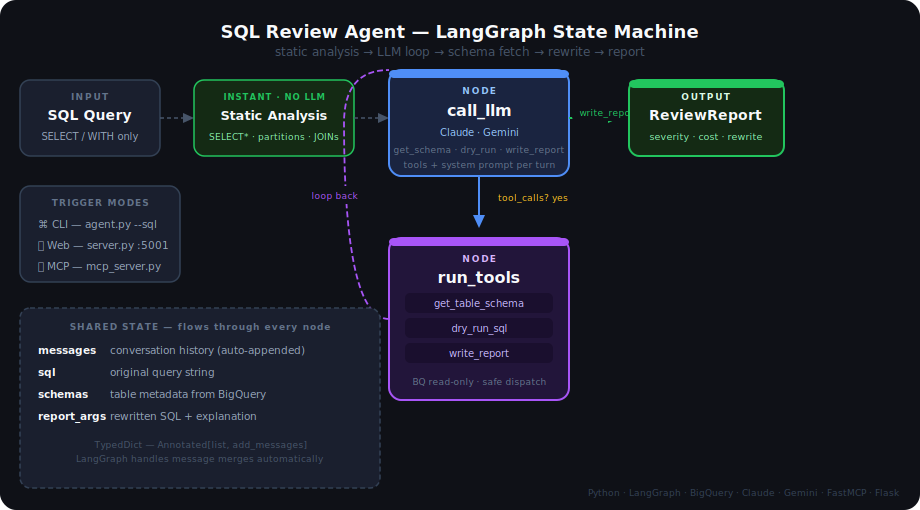
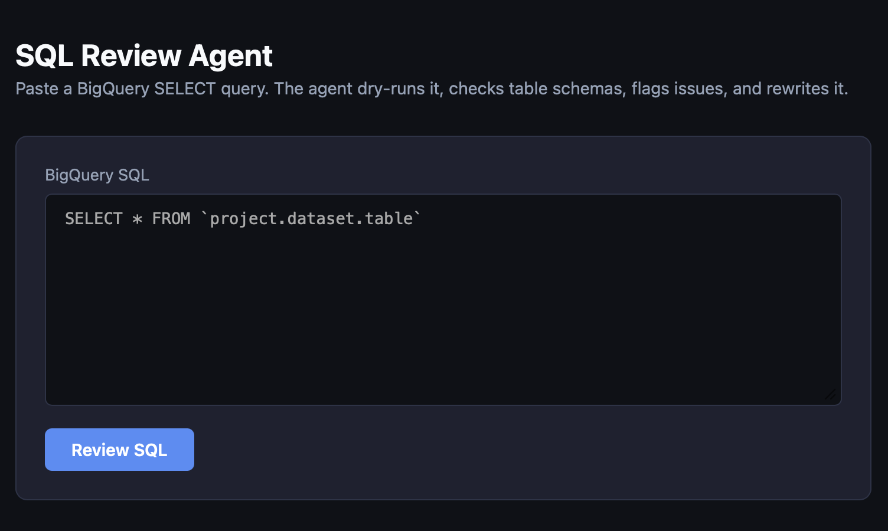

# SQL Review Agent

An agentic AI system that reviews BigQuery SQL queries before you run them —
catching performance issues, estimating cost, and suggesting rewrites.

---

## What it does

Paste a BigQuery SQL query and the agent:

1. **Static analysis** — instantly flags `SELECT *`, missing partition filters, cartesian joins
2. **Schema fetch** — reads partition keys, clustering fields, and row counts from BigQuery
3. **Cost estimate** — dry-runs the query to get bytes scanned without executing it
4. **Rewrite** — returns improved SQL with a plain-English explanation
5. **Severity rating** — `none` / `low` / `medium` / `high` / `critical`

---

## Architecture

The agent is modelled as a LangGraph state machine:



- **call_llm** — sends messages + tools to Claude/Gemini
- **run_tools** — dispatches `get_table_schema`, `dry_run_sql`, `write_report`
- **route** — conditional edge: loop back if tool calls remain, stop when `write_report` is called

---

## Three trigger modes

| Mode | How |
|---|---|
| CLI | `python agent.py --sql "SELECT * FROM ..."` |
| Web UI | `python server.py` → open `localhost:5001` |
| MCP | Any MCP-compatible client (Claude Code, Cursor, Zed, OpenClaw) |

---

## Setup

```bash
git clone https://github.com/ARAVINDHRAJA123/sql-review-agent.git
cd sql-review-agent
python3 -m venv venv && source venv/bin/activate
pip install -r requirements.txt

export GCP_PROJECT=your-project
export BQ_LOCATION=asia-south1
export GEMINI_API_KEY=your-key     # free tier: aistudio.google.com
# or: export ANTHROPIC_API_KEY=your-key

gcloud auth application-default login
```

### MCP (Claude Code)

```bash
claude mcp add -s user sql-review -- \
  /path/to/venv/bin/python /path/to/mcp_server.py
```

Tools available in any MCP client:
- `review_sql` — full agentic review (LLM + BQ)
- `quick_check` — instant static analysis, no LLM needed

---

## CLI usage

```bash
python agent.py --sql "SELECT * FROM \`project.dataset.table\`"
python agent.py --file query.sql --verbose
```

## Web UI



```bash
python server.py
# open http://localhost:5001
```

## Tests

```bash
pytest
pytest tests/test_tools.py -v
```

---

## Project structure

```
sql-review-agent/
├── agent.py          ← raw tool-use loop (Claude + Gemini)
├── graph_agent.py    ← LangGraph state machine (drop-in replacement)
├── mcp_server.py     ← FastMCP server (review_sql + quick_check tools)
├── server.py         ← Flask web UI + JSON API
├── tools/
│   ├── bq_tools.py   ← dry_run, schema, metadata, read-only guard
│   └── sql_tools.py  ← static analysis, table extraction
├── tests/
│   ├── test_tools.py ← 24 unit tests
│   └── test_agent.py ← 7 unit tests
└── docs/
    ├── architecture_graph.svg  ← state machine diagram
    └── web_ui.png              ← Flask UI screenshot
```

---

## Stack

Python · BigQuery · Claude API · Gemini API · LangGraph · FastMCP · Flask · pytest
